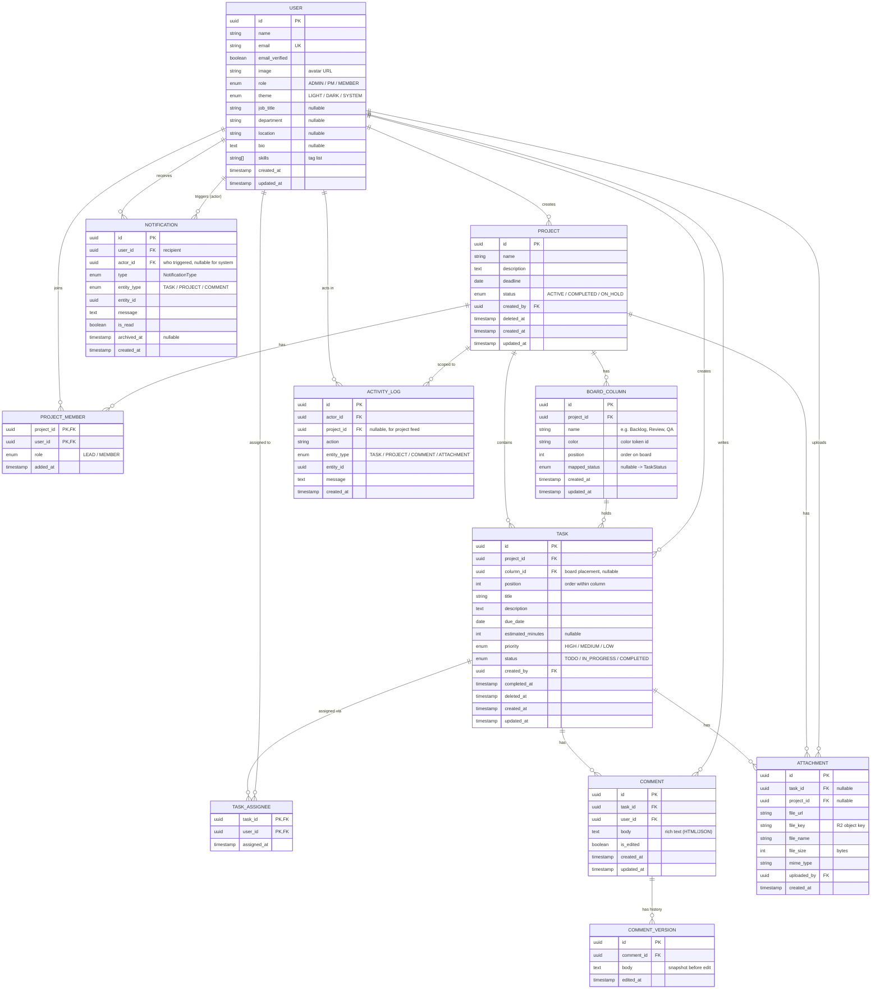

<div align="center">


# TaskFlow

**A calm, editorial workspace for project & task collaboration.**

TaskFlow turns project management from a noisy queue into a focused ledger — projects,
Kanban boards, multi-assignee tasks, threaded comments, role-scoped dashboards, a live
notification feed, and an AI assistant that answers (and acts) over your real data within
your permission boundary.

</div>

---

## Table of Contents

- [Repository layout](#repository-layout)
- [Tech stack](#tech-stack)
- [How the code works](#how-the-code-works)
- [Getting started](#getting-started)
- [Features](#features)
- [The chat / assistant system](#the-chat--assistant-system)
- [Entity Relationship Diagram (ERD)](#entity-relationship-diagram-erd)
- [Project documentation](#project-documentation)

---

## Repository layout

This is a **mono-repo of two git submodules** plus the shared design docs that act as the
single source of truth (the API contract, the schema, the system design).

```text
task-flow/                  # ← this repo (docs + submodule pointers)
├── web-app/                # submodule → Next.js frontend
├── server/                 # submodule → Express + Prisma backend
└── screens/                # reference UI designs
```

Clone with submodules:

```bash
git clone --recurse-submodules <repo-url>
# or, if already cloned:
git submodule update --init --recursive
```

> **Submodules:** `web-app` → `task-flow-web-app`, `server` → `task-flow-server`. The root
> repo only tracks which commit of each submodule is "current"; the actual code lives in
> the submodule repos.

---

## Tech stack

| Layer        | Choices                                                                                                                                                                                                                       |
| ------------ | ----------------------------------------------------------------------------------------------------------------------------------------------------------------------------------------------------------------------------- |
| **Frontend** | Next.js 16 (App Router, React 19), TypeScript, Tailwind CSS v4, shadcn / Radix / Base UI, TanStack Query, Zustand, `@hello-pangea/dnd` (Kanban drag), TipTap (rich comments + @mentions), Recharts, Better Auth client, Axios |
| **Backend**  | Bun runtime, Express 5, Prisma 7 (PostgreSQL via `@prisma/adapter-pg`), Better Auth, Zod v4, Helmet + CORS, OpenAI SDK (Azure mode), AWS S3 SDK (R2)                                                                          |
| **Auth**     | Better Auth (email/password, session cookies) shared between client and server                                                                                                                                                |
| **AI**       | Azure OpenAI (function-calling) for the assistant                                                                                                                                                                             |
| **Deploy**   | Server targets Vercel serverless; web-app on Next.js/Vercel                                                                                                                                                                   |

---

## How the code works

### Big picture

```
Browser ── Next.js (web-app) ──HTTP/JSON+cookie──> Express (server) ── Prisma ──> PostgreSQL
                  │                                      │
            TanStack Query                          Azure OpenAI (assistant tool-calls)
```

The frontend and backend are **two independent deployables** that agree on one contract:
[`API_SPEC.md`](API_SPEC.md) (sections §1–13). Auth is cookie-based via Better Auth, shared
across both sides; the browser sends the session cookie with `credentials: true`.

### Backend (`server/`)

A **modular Express 5 app**. Every domain lives in `server/src/modules/<name>/` as a vertical
slice: `*.routes.ts → *.controller.ts → *.service.ts` with `*.validation.ts` (Zod) and, where
access matters, `*.access.ts` (role-scoping helpers). The entry point
[`server/src/index.ts`](server/src/index.ts) mounts each module under `/api/*`:

```
/api/auth/*       Better Auth (mounted before express.json)
/api/config       /api/profile       /api/projects      /api/projects/:id/tasks
/api/tasks        /api/tasks/:id/comments               /api/team
/api/users        /api/notifications /api/dashboard      /api/activities
/api/search       /api/assistant
```

Cross-cutting code lives in `server/src/shared/` (errors, constants, utils) and
`server/src/middleware/` (auth guard, Zod `validate`, error handler).

**Authorization is structural, not ad-hoc.** Helpers like `buildProjectScopeWhere` and
`buildTaskScopeWhere` build the Prisma `where` clause from the caller's role, so a MEMBER's
query can only ever return their own rows. ADMIN sees everything, PM sees their projects,
MEMBER sees what they're assigned/member of.

**Data layer:** Prisma 7 with a split-file schema under `server/prisma/schema/` (per entity).
Soft deletes (`deleted_at`) on Project and Task; comment edit history via `CommentVersion`.

Two Express-5 / Better-Auth gotchas baked into the code:

1. `req.query` is getter-only in Express 5 — the `validate` middleware redefines it via
   `Object.defineProperty`.
2. Better-Auth user IDs are **not** UUIDs — they're validated as `z.string().min(1).max(64)`;
   only entity IDs (project/task/column) are `.uuid()`.

### Frontend (`web-app/`)

Next.js App Router. Routes are thin: a `page.tsx` renders a **screen**. The real UI lives in
`web-app/src/screens/<feature>/` (each with co-located `_components/`), kept separate from
routing so screens stay portable.

- **Routing:** public routes (`/`, `/auth/*`, `/how-it-works`, `/privacy`) and an authed
  `(dashboard)` group (`/dashboard`, `/projects`, `/projects/[id]`, `/tasks`, `/tasks/[taskId]`,
  `/team`, `/team/[id]`, `/profile`, `/notifications`).
- **Data:** TanStack Query throughout. The `services/` folder is layered as
  `api/` (Axios callers) → `keys/` (query keys) → `query/` & `mutation/` (hooks). Components
  never call Axios directly — they use a query/mutation hook.
- **Forms** use `useState` + Zod (react-hook-form is intentionally not used).
- **Mounted everywhere authed:** the floating assistant widget lives in
  `components/layouts/dashboard-layout.tsx`.

---

## Getting started

**Server**

```bash
cd server
bun install
# set up .env (DATABASE_URL, BETTER_AUTH_SECRET, CORS_ORIGIN, AZURE_OPENAI_*, R2/S3 keys)
bunx prisma db push                # apply schema
bun run scripts/seed.ts --reset    # seed demo data
bun run run:dev                    # watch mode
```

**Web app**

```bash
cd web-app
bun install
bun dev                            # http://localhost:3000
```

**Demo accounts** (seed): all passwords are `Ab@12345`. Emails: `admin@taskflow.com`,
`pm1@taskflow.com` / `pm2@taskflow.com`, `user1@taskflow.com … user20@taskflow.com`.
Log in via Better Auth (`POST /api/auth/sign-in/email`). Seed volume: 5 projects / 58 tasks /
80 comments / 363 notifications / 130 activity entries.

---

## Features

Each feature is a full vertical slice (backend module + wired frontend screen).

### 🔐 Authentication & profile

- **Email/password auth** via Better Auth — login, signup (always creates a `MEMBER`),
  session cookies, password-reset scaffolding.
- **Profile** — name, avatar (crop/upload), theme (light/dark/system), and an editable
  **Professional Details** section (job title, department, location, phone, bio, skills) that
  powers the Team Directory.

### 📁 Projects

- Create / edit / delete (soft-delete) projects with name, description, status
  (`ACTIVE` / `COMPLETED` / `ON_HOLD`) and optional deadline.
- **Project members** with a per-project role (`LEAD` / `MEMBER`); the creator is auto-added
  as `LEAD`. PM/ADMIN manage membership.
- Projects list + a rich **Project Details** page with derived progress.

### 🗂️ Kanban board

- Each project gets **user-defined columns** (auto-seeded with Todo / In Progress / Completed).
- **Drag tasks** between columns (optimistic `PATCH move`), reorder columns, add/rename columns.
- A column may carry a `mapped_status`: dropping a task into it updates the task's analytics
  status (and `completed_at`) automatically — board position is presentation, `status` is truth.

### ✅ Tasks

- Tasks always belong to a project; have title, description, priority (`HIGH`/`MEDIUM`/`LOW`),
  status (`TODO`/`IN_PROGRESS`/`COMPLETED`), due date, optional estimate.
- **Multiple assignees** per task (assignees must be project members).
- All-Tasks list, Task Details, create/edit/delete via the task form sheet, quick status change.
- Status → `COMPLETED` auto-sets `completed_at` (cleared when leaving) — feeds progress trends.
- Per-project **unique task titles** (partial unique index, ignores soft-deleted).

### 💬 Comments

- Threaded, **rich-text** comments on tasks (TipTap) with **@mentions**.
- Editable with full history — each edit snapshots the prior body into `CommentVersion` and
  flips `is_edited`. Mentions and new comments emit notifications + activity.

### 🔔 Notifications

- Per-user feed with **all / unread / archived** tabs, unread-count badge, mark-read,
  mark-all-read, archive.
- Typed events (task assigned/unassigned/status/overdue/due-soon, comment added/mention,
  project member/status/deadline, attachment) with a deep-link target. A reusable
  `sendNotifications()` emitter dedupes and excludes the actor.

### 📊 Dashboard

- Role-scoped KPIs: project/task counts, tasks by status & priority, member workload,
  upcoming deadlines, per-project progress.
- Charts (Recharts), recent-activity feed, upcoming-deadline list, workload meter
  (`pending/10` capacity; overloaded ≥ 90%).

### 👥 Team & users

- **Team Directory** + **Member Details** (real tasks, skills, workload).
- **Admin user management** — list users, change a user's global role (`MEMBER`/`PM`/`ADMIN`,
  admin-only, can't change your own), user search. Role elevation is admin-only by design.

### 📈 Activity log

- Audit trail of system actions for the recent-activity feed, optionally project-scoped.
  Written via a best-effort `logActivity()` helper that never throws.

### 🔎 Search

- Role-scoped search across tasks and projects (`/api/search`).

### 🤖 AI Assistant

- A floating chat that answers over your real data **and can take actions** — see below.

> **Not yet built:** §7 attachments (schema + R2 wiring designed, UI deferred).

---

## The chat / assistant system

TaskFlow ships an **AI assistant** (Azure OpenAI, function-calling) embedded in the dashboard.
Full design lives in [`CHATBOT_PLAN.md`](CHATBOT_PLAN.md).

### The core security principle

> **The LLM never touches the database and never writes a query.** It can only call a small,
> role-gated whitelist of **tools**. Each tool internally runs an existing role-scoped service
> with the caller's session.

```
User: "What's my current progress?"
  │
  ▼
LLM (Azure OpenAI) ── detects intent → calls tool: get_my_progress()
  │
  ▼
Tool layer ── runs the existing service WITH req.user
  │            (buildTaskScopeWhere(user) filters rows in trusted code)
  ▼
only permitted rows returned → LLM phrases the answer → user
```

Because the boundary lives in the **data layer** (`buildProjectScopeWhere` /
`buildTaskScopeWhere`), a MEMBER asking "show all projects in the system" structurally cannot
get more than their own rows — the model has no knowledge of the DB, schema, or other users to
leak. This is a _tool-calling agent over a whitelist_, not RAG.

### The chat loop

1. The browser widget (`web-app/src/components/assistant/`) sends the message + the last ~10
   turns of history to `POST /api/assistant/chat` (with the session cookie).
2. The server (`server/src/modules/assistant/`) builds a **role-aware system prompt**
   (`assistant.guard.ts`), exposes only the tools allowed for that role
   (`assistant.tools.ts`), and runs the OpenAI tool-call loop (`assistant.service.ts`):
   send messages + tool defs → model returns `tool_calls` → run them server-side (role-scoped)
   → append results → call again → final natural-language answer.
3. The reply can include **clickable action chips** — markdown links with an `#action` URL the
   widget renders as buttons (e.g. multi-step _create task_ / _assign_ / _login_ wizards).

### Tools & role gating

Authorization is enforced at two layers: **(a)** which tools are exposed for the role, and
**(b)** the scope-where inside each tool (the real boundary — defense in depth).

| Tool                               | Purpose                                                | Roles                              |
| ---------------------------------- | ------------------------------------------------------ | ---------------------------------- |
| `get_my_progress`                  | completed / pending / overdue counts + %               | all                                |
| `get_my_tasks(status?)`            | the caller's tasks                                     | all                                |
| `get_my_notifications`             | the caller's notifications                             | all                                |
| `get_dashboard_stats`              | role-scoped KPIs, status/priority, deadlines, workload | all (workload stripped for MEMBER) |
| `search_users(name?, role?)`       | look up users / pick a PM or LEAD                      | all                                |
| `update_task_status(...)`          | move / mark a task (action)                            | all                                |
| `get_team_tasks(status?, userId?)` | tasks across the team's projects                       | PM / ADMIN                         |
| `create_project(...)`              | create a project (action)                              | PM / ADMIN                         |
| `create_task(...)`                 | create a task (action)                                 | PM / ADMIN                         |
| `assign_task(...)`                 | assign / unassign a task (action)                      | PM / ADMIN                         |

### Guardrails (layered)

1. **System prompt** — persona, role, hard "do not" list (no DB/infra/schema/other-people's
   data; refuse off-topic; only state facts from tool results — never invent).
2. **Tool whitelist** — role-gated; the model can't act outside it.
3. **Scope-where (data layer)** — the actual security; can't be bypassed.
4. **Output guard** — strip raw IDs / internal fields (optional).
5. **Rate limit + audit log** — planned (Phase 3).

### Unauthenticated mode

The same endpoint serves anonymous visitors with **no data tools** — it explains what TaskFlow
is, answers basic privacy questions, and walks a visitor through login/signup step-by-step,
emitting a confirm chip (`[Confirm Login](#action:login:EMAIL:PASSWORD)`) the widget executes.

### Build status

- ✅ **Phase 1–2** — assistant module, Azure OpenAI loop, read + action tools, role gating,
  dashboard widget, unauthenticated info/auth flow.
- ⏳ **Phase 3** — persisted chat history, audit log, rate limit, SSE streaming (currently a
  single JSON reply).
- ⏳ **Phase 4** — dedicated public landing bot + lead capture.

---

## Entity Relationship Diagram (ERD)

Full schema, constraints, enums, and the Prisma layout are in [`ERD.md`](ERD.md). The core
domain (Better-Auth `Session`/`Account`/`Verification` omitted for clarity):



**Enums:** `Role` (ADMIN/PM/MEMBER) · `Theme` (LIGHT/DARK/SYSTEM) ·
`ProjectStatus` (ACTIVE/COMPLETED/ON_HOLD) · `ProjectMemberRole` (LEAD/MEMBER) ·
`TaskPriority` (HIGH/MEDIUM/LOW) · `TaskStatus` (TODO/IN_PROGRESS/COMPLETED) ·
`NotificationType` (12 typed events). See [`ERD.md`](ERD.md) for the full constraint list.

---

## Project documentation

| Doc                                                         | What's in it                                            |
| ----------------------------------------------------------- | ------------------------------------------------------- |
| [`API_SPEC.md`](API_SPEC.md)                                | The REST contract (§1–13) both client and server follow |
| [`ERD.md`](ERD.md)                                          | Database schema, constraints, enums, Prisma layout      |
| [`SYSTEM_DESIGN.md`](SYSTEM_DESIGN.md)                      | End-to-end architecture                                 |
| [`BACKEND_PLAN.md`](BACKEND_PLAN.md)                        | Backend build plan & module breakdown                   |
| [`CHATBOT_PLAN.md`](CHATBOT_PLAN.md)                        | Assistant design & security model                       |
| [`REQUREMENTS.md`](REQUREMENTS.md)                          | Product requirements                                    |
| [`design.md`](design.md) / [`components.md`](components.md) | UI / component reference                                |

---

<div align="center">
<sub>Built by Mehedi Sarkar · TaskFlow</sub>
</div>
